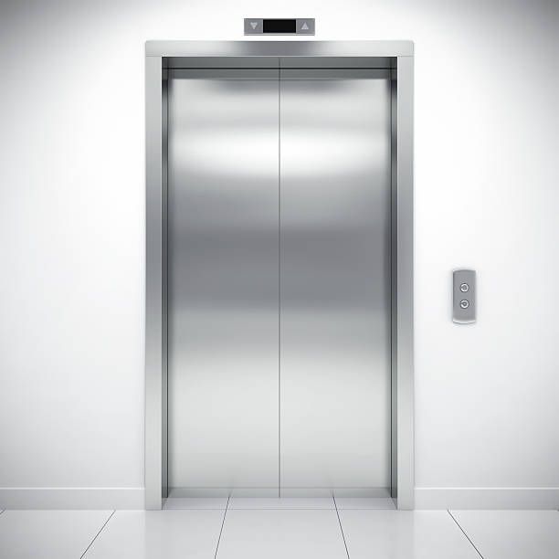

# Challenge 9
Design an Elevator System

Our elevator has the basic function that all elevator systems have, such as
moving up and down, opening and closing doors, and of course, picking up
passengers.

The elevator is supposed to be used in a building having floors numbered from
1 to MaxFloor, where the first floor is the lobby. There are car / lift call
buttons in the car corresponding to each floor. For every floor except for the
top floor and the lobby, there are two hall call buttons for the passengers to
call for going up and down. There is only one down hall call button at the top
floor and one up hall call button in the lobby. When the car stops at a floor,
the doors are opened and the car lantern indicating the current direction the
car is going is illuminated so that the passengers can get to know the current
moving direction of the car. The car moves fast between floors, but it should
be able to slow down early enough to stop at a desired floor. For system
safety, an emergency brake to stop the car is part of the design.

Use a use case diagram to understand the high level functions, then use SysML
BDD or UML class diagrams, and sequence diagrams to design the system.

The design you come up with should be a high level overview, see how much you
can design in 30 minutes.